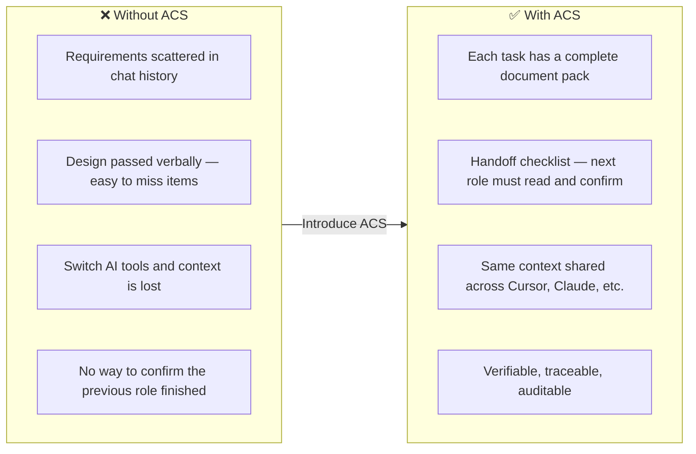
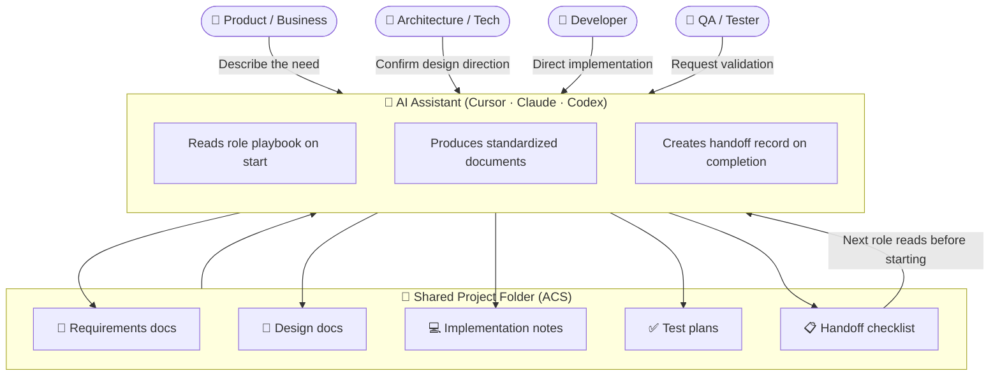
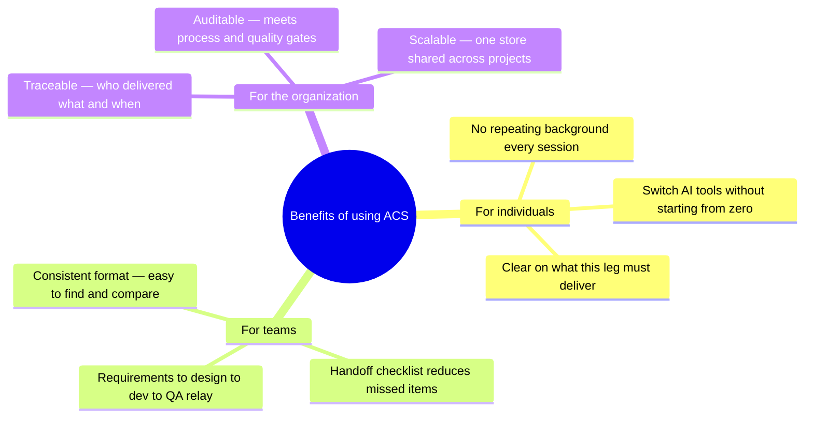

[](https://deepwiki.com/max9159/agent-context-store)

# Agent Context Store

Agent Context Store (`acs`) is a Git-backed handoff toolkit for BA, SA, Dev, and QA agents to produce validated SDLC artifacts — SRS, design docs, ADRs, API specs, test plans — and relay them through confirmed handoff records. Works with Cursor, Claude Code, Codex, CI, and custom runtimes.

## Concept Overview

> ACS turns tacit knowledge trapped in AI chat sessions into formal deliverables that teams can relay, verify, and retain.

The three diagrams below explain the value, relay flow, and benefits of using ACS. For implementation details, see [Architecture](docs/DEVELOPMENT.md#architecture).

### 1 · Problem vs Solution



### 2 · Relay flow

People describe what they need; AI follows role playbooks to produce standardized documents and handoff records; the next role reads the full task pack before starting.



| Step | In plain terms |
|------|----------------|
| **1 · Install playbooks** | Each role's AI knows what to produce and how to hand off. |
| **2 · Role starts work** | The AI reads its playbook and knows which leg of the relay it owns. |
| **3 · Produce documents** | Structured, numbered deliverables — not free-form chat output. |
| **4 · Formal handoff** | A handoff checklist is created; the next role must confirm before starting. |
| **5 · Persist and share** | Everything is saved to a Git folder for the team and CI. |

### 3 · Benefits



```
┌─────────────────────────────────────────────────────────────────────┐
│  What you get with ACS                                              │
├─────────────────────────────────────────────────────────────────────┤
│  📦 Complete task pack    End-to-end docs from requirements to QA   │
│  🔗 Reliable handoff      Formal checklist, not "remember to tell"  │
│  🧠 Cross-session memory  Context survives tool or people changes   │
│  ✅ Verifiable start      Next role confirms previous leg is done   │
│  📜 Full history          Git-backed — investigate, restore, audit  │
└─────────────────────────────────────────────────────────────────────┘
```

## Prerequisites
- Node.js `>=20`
- Git
- A project repository or folder

## Step 1: Install the CLI
```bash
npm install -g agent-context-store
acs --help
```

## Step 2: Initialize the store

Run `acs init` in your project directory. When stdin is a terminal, an interactive wizard guides you through three choices:

```bash
acs init
? How should the context store be hosted?
  ❯ in-repo   — .acs/ lives inside this project (default)
    local     — stored in your user data dir, nothing committed
    dedicated — a separate repo shared across multiple projects

? Path to the dedicated store repo:   ← only shown for dedicated mode

? Install agent skill files? (space to toggle)
  ✓ Claude Code  → ~/.claude/skills/
  ✓ Cursor       → ~/.cursor/skills/
  ○ Codex        → ~/.codex/skills/
```

For the full command list, see [Commands](#commands).

## Step 3: Run Your First Workflow

After setup, each team member opens their AI agent (Codex, Cursor or Claude Code) and invokes the matching role skill by name. The skill tells the agent exactly which `acs` commands to run — the human never types `acs` directly.

> **AI Agent Skill invocation syntax**
> - For Codex, Cursor or Claude Code: `/acs-ba`, `/acs-sa`, `/acs-dev`, `/acs-qa`

The examples below follow a single feature task `DEMO-0001: Login with OTP` through the full BA → SA → Dev → QA lifecycle.

---

### Use Case 1 — BA captures requirements

**Human → Cursor / Claude Code:**
```
/acs-ba We need to add OTP-based login. Task ID is DEMO-0001. Title: "Login with OTP".
```
<details>
  <summary>The `acs-ba` skill activates and the agent internally runs:</summary>

  ```bash
  acs status && acs doctor
  acs ba new srs --task DEMO-0001 --title "Login with OTP"
  acs ba new user-story --task DEMO-0001 --title "Login with OTP User Story"
  acs ba new acceptance-criteria --task DEMO-0001 --title "Login with OTP Acceptance Criteria"
  acs validate --role ba --task DEMO-0001
  acs handoff create --from ba --to sa --task DEMO-0001
  acs package --task DEMO-0001 --role sa
  acs index
  ```

</details>

```
The agent ends its response with a structured `[HANDOFF: BA → SA | DEMO-0001]` prompt for the SA agent to pick up.
```

---

### Use Case 2 — SA produces system design

**Human → Cursor / Claude Code:**
```
/acs-sa Pick up DEMO-0001 from BA. Design the OTP login system.
```
<details>
  <summary>The `acs-sa` skill activates and the agent internally runs:</summary>

  ```bash
  acs next --role sa --task DEMO-0001
  acs sa new sdd --task DEMO-0001 --title "Login with OTP System Design"
  acs sa new adr --task DEMO-0001 --title "Use Redis for OTP State"
  acs sa new api-design --task DEMO-0001 --title "OTP Login API"
  acs validate --role sa --task DEMO-0001
  acs handoff create --from sa --to dev --task DEMO-0001
  acs package --task DEMO-0001 --role dev
  acs index
  ```

</details>

```
The agent ends its response with a `[HANDOFF: SA → DEV | DEMO-0001]` prompt.
```

---

### Use Case 3 — Dev implements the feature

**Human → Cursor / Claude Code:**
```
/acs-dev Implement DEMO-0001 based on the SA design. Task ID is DEMO-0001.
```

<details>
  <summary>The `acs-dev` skill activates and the agent internally runs:</summary>

  ```bash
  acs next --role dev --task DEMO-0001
  acs dev new implementation-note --task DEMO-0001
  acs validate --role dev --task DEMO-0001
  acs handoff create --from dev --to qa --task DEMO-0001
  acs package --task DEMO-0001 --role qa
  acs index
  ```

</details>

```
The agent ends its response with a `[HANDOFF: DEV → QA | DEMO-0001]` prompt.
```

---

### Use Case 4 — QA validates and closes the task

**Human → Cursor / Claude Code:**
```
/acs-qa Write the test plan for DEMO-0001.
```

<details>
  <summary>The `acs-qa` skill activates and the agent internally runs:</summary>

  ```bash
  acs next --role qa --task DEMO-0001
  acs qa new test-plan --task DEMO-0001 --title "OTP Login Test Plan"
  acs validate --role qa --task DEMO-0001
  acs handoff list --task DEMO-0001
  acs index
  ```

</details>

```
All four role artifacts and handoff records are now persisted in the store.
```


## Context Store Layout

- In **in-repo** mode the store root is `.acs/`; in **dedicated** mode it is the store repository root.
- Role deliverables are written under `artifacts/{task_id}/{type}/` (for example `artifacts/DEMO-0001/srs/SRS-DEMO-0001.md`).
- Handoff records go to `handoffs/`.
- Context bundles for the next role go to `packages/`.

For the full directory tree and file-by-file guide, see [ACS Context Store Full Content Guide](docs/ACS_CONTEXT_STORE_INTRO_en.md).

## Commands

| Command              | What it does                                                                                            |
| -------------------- | ------------------------------------------------------------------------------------------------------- |
| `acs --version`      | Prints the installed CLI version.                                                                       |
| `acs init`           | Initializes the context store. Runs an interactive wizard on a TTY; pass `--mode` to skip it.          |
| `acs link`           | Links a project to an existing ACS store by writing only `.acs/config.yaml`.                           |
| `acs status`         | Shows current mode, store path, initialized state, and artifact/handoff counts.                         |
| `acs install-skills` | Installs agent-specific skill and instruction files for Cursor, Claude, Codex, or all supported agents. |
| `acs roles`          | Lists configured role profiles (`ba`, `sa`, `dev`, `qa`).                                              |
| `acs role explain`   | Explains what a role can create/read and suggests task commands.                                        |
| `acs next`           | Shows missing inputs, suggested outputs, and next workflow commands.                                    |
| `acs new`            | Creates a configured SDLC artifact.                                                                     |
| `acs validate`       | Validates the context store structure, artifact metadata, schemas, and handoff records.                 |
| `acs handoff create` | Creates a role-to-role handoff record for a task.                                                       |
| `acs handoff check`  | Validates a specific handoff before another agent relies on it.                                         |
| `acs handoff list`   | Lists handoff records, optionally filtered by task or role.                                             |
| `acs package`        | Builds a role-specific context package for the next agent or automation step.                           |
| `acs index`          | Rebuilds `index.json` from artifacts and handoffs.                                                      |
| `acs site kanban`    | Serve (or build) the built-in zero-dep Kanban/Dashboard SPA with live reload.                           |
| `acs site docs`      | Serve the MkDocs Material docs site over your artifact Markdown (requires MkDocs).                      |
| `acs site`           | Run both engines concurrently on separate ports; single Ctrl-C tears both down.                         |

`acs package` includes a context budget advisory in Markdown and JSON output.
Use `--max-tokens <N>` to override the configured budget for one run. The CLI
does not split or rewrite artifacts; role skills decide semantic phase documents
when the advisory reports `warning`, `high`, or `split_recommended`.
| `acs doctor`         | Runs the same validation checks as `acs validate` for quick health checks.                              |

### Hybrid site preview

`acs site` provides two rendering engines you can run independently or together:

**Engine A — Kanban (built-in, zero-dependency)**

```bash
acs site kanban                              # serve at http://127.0.0.1:8000/ with live reload
acs site kanban --build-only                 # generate static files under .acs/site/ and exit
acs site kanban --build-only --task DEMO-0001 # site focused on a single task
acs site kanban --port 9000 --no-watch       # custom port, no file-watching
```

The Kanban engine writes under `site/` inside the resolved ACS store root:

```
site/
  index.html
  assets/
    site.css
    site.js     (includes live-reload EventSource, no-op under file://)
  data/
    model.json
```

Views: Dashboard, Kanban board, Artifact browser, Handoff table, Validation report.
Live reload is driven by SSE at `/__livereload`; file-watching covers `artifacts/`, `handoffs/`, and `audit/`.

> **Note:** `acs site build` has been removed. Use `acs site kanban --build-only` instead.

**Engine B — Docs (MkDocs + Material, optional)**

MkDocs is an optional user-installed Python tool. The engine degrades gracefully if it is absent.

```bash
# Install MkDocs (once)
pip install mkdocs mkdocs-material

acs site docs                    # serve at http://127.0.0.1:8001/
acs site docs --build-only       # build static HTML output and exit
```

The docs engine writes only `site-docs/mkdocs.yml` under the store root.
It **never writes anything under `artifacts/`** — doing so would break `acs validate`.

**Concurrent mode**

```bash
acs site                         # run both engines, print both URLs, single Ctrl-C teardown
acs site --kanban-port 8000 --docs-port 8001
acs site --no-watch              # disable Kanban file-watching (MkDocs has its own reload)
```

**Flag defaults**

| Flag | Default | Notes |
| --- | --- | --- |
| `--port` / `--kanban-port` | `8000` | Kanban engine port |
| `--docs-port` | `8001` | Docs engine port |
| `--host` | `127.0.0.1` | Loopback only |
| `--no-watch` | off | Disable Kanban live reload (MkDocs reload unaffected) |
| `--build-only` | off | Generate and exit; no server |
| `--open` | off | Open browser after start |

**Derived output**

Both `site/` and `site-docs/` are disposable derived output. They are never scanned by `acs validate` or `acs index`. Recommended `.gitignore` entries for generated stores:

```
.acs/site/
.acs/site-docs/
```

### Full syntax

```bash
acs --version
acs init [path] [--mode <in-repo|local|dedicated>]
acs link <existing_store_path> [--path <project_path>] [--force]
acs status
acs install-skills --agent <cursor|claude|codex|openclaw|all> [--path <path>]
acs roles
acs role explain <ROLE> [--task <TASK_ID>]
acs new <ARTIFACT_TYPE> [--role <ROLE>] --task <TASK_ID> [--title <TITLE>]
acs <ROLE> new <ARTIFACT_TYPE> --task <TASK_ID> [--title <TITLE>]
acs next --role <ROLE> --task <TASK_ID>
acs validate [--role <ROLE>] [--task <TASK_ID>] [--artifact <PATH>]
acs handoff create --from <ROLE> --to <ROLE> --task <TASK_ID>
acs handoff check <HANDOFF_ID_OR_PATH>
acs handoff check --from <ROLE> --to <ROLE> --task <TASK_ID>
acs handoff list [--task <TASK_ID>] [--role <ROLE>]
acs package --task <TASK_ID> --role <ROLE> [--format markdown|json] [--max-tokens <N>]
acs <ROLE> package --task <TASK_ID> [--format markdown|json] [--max-tokens <N>]
acs log --task <TASK_ID> [--tail N] [--json]
acs index
acs doctor
acs site [--kanban-port <N>] [--docs-port <N>] [--host <H>] [--no-watch] [--open] [--task <ID>]
acs site kanban [--build-only] [--port <N>] [--host <H>] [--no-watch] [--open] [--task <ID>]
acs site docs [--build-only] [--port <N>] [--host <H>] [--open]
```

## Aligned with Industry Handoff Standards

`acs` applies handoff patterns from the [OpenAI Agents SDK](https://openai.github.io/openai-agents-python/handoffs/), [Microsoft Agent Framework](https://learn.microsoft.com/en-us/agent-framework/workflows/orchestrations/handoff), and Google's [Agent2Agent (A2A) protocol](https://github.com/a2aproject/A2A) to BA, SA, Dev, and QA — persisting each handoff to Git as a schema-validated, reviewable contract rather than an in-memory tool call, so work survives across runtimes, sessions, and CI.

| Concept | Industry definition | `acs` equivalent |
|---------|--------------------|------------------|
| **Typed handoff contract** | OpenAI's `handoff()` with `input_type` schema, `handoff_description`, and `on_handoff` callback validates the data passed between agents. [[#1]](#references) | `acs handoff create --from <ROLE> --to <ROLE> --task <TASK_ID>` writes a YAML record validated against a JSON schema; `acs handoff check` is the receiver-side guard equivalent to `on_handoff` validation. |
| **Context filtering on handoff** | OpenAI `input_filter` and Microsoft's `HandoffAgentExecutor` strip handoff tool calls before forwarding to the next agent. [[#1]](#references) [[#2]](#references) | `acs package --task <TASK_ID> --role <ROLE>` builds a role-scoped context bundle so the receiving agent reads only what is relevant to its job. |
| **Full task ownership transfer** | Microsoft Agent Framework: "the agent receiving the handoff takes full ownership of the task" (vs. agent-as-tools, where control returns). [[#2]](#references) | BA → SA → Dev → QA each take complete ownership of the task in their phase; control does not return to the previous role. |
| **Mesh topology, no central orchestrator** | Microsoft: agents are connected directly; each decides when to hand off. [[#2]](#references) | No orchestrator process — each role agent independently decides when its artifacts are complete and issues a handoff. The store is the shared substrate. |
| **Dynamic routing rules** | Microsoft `HandoffBuilder.add_handoff(...)` / `WithHandoffs(...)` declares which agents may route to which. [[#2]](#references) | `workflows/` and `roles/` in the store define the legal BA→SA→Dev→QA edges; `acs validate` rejects out-of-policy handoffs. |
| **Capability discovery (Agent Cards)** | A2A: agents advertise abilities via JSON Agent Cards so peers know what they can do. [[#3]](#references) | `acs roles` and `acs role explain <ROLE>` expose each role's inputs, outputs, and allowed artifact types — the role profile is the Agent Card. |
| **Tasks & artifacts as the unit of exchange** | A2A: communication centers on tasks with lifecycles; artifacts are the task outputs. [[#4]](#references) | Every `acs` operation is keyed by `--task <TASK_ID>`; `artifacts/<TASK_ID>/` holds the schema-validated outputs of each role's task phase. |
| **Durable, resumable workflows** | Microsoft `checkpoint_storage` / `FileCheckpointStorage` lets workflows pause and resume hours or days later. [[#2]](#references) | The Git-tracked store *is* the checkpoint. Any agent on any machine can `git pull` and resume from the last validated handoff. |
| **Runtime-agnostic interoperability** | A2A: opaque agents on different frameworks collaborate without sharing memory or internal state. [[#4]](#references) | Cursor, Claude Code, Codex, and CI agents collaborate purely through validated artifacts and handoff records — no shared runtime, no shared memory. |
| **Auditable handoff history** | A2A emphasizes observability and auditability for enterprise use. [[#4]](#references) | `audit/`, `index.json`, `acs handoff list`, and Git history give a complete, reviewable trail of every handoff. |

In short: industry handoff frameworks model handoffs as in-process tool calls between live agent instances. `acs` models them as **persisted, schema-validated, Git-reviewable contracts** — making the same pattern work across role boundaries, agent runtimes, machines, and time.

### References

1. OpenAI Agents SDK — Handoffs: <https://openai.github.io/openai-agents-python/handoffs/>
2. Microsoft Agent Framework — Handoff Orchestration: <https://learn.microsoft.com/en-us/agent-framework/workflows/orchestrations/handoff?pivots=programming-language-csharp>
3. Google Developers Blog — A2A: A new era of agent interoperability: <https://developers.googleblog.com/en/a2a-a-new-era-of-agent-interoperability/>
4. A2A Project — Agent2Agent protocol repository: <https://github.com/a2aproject/A2A>

## Contributing

To build, test, or contribute to ACS, see the [Development Guide](docs/DEVELOPMENT.md).
