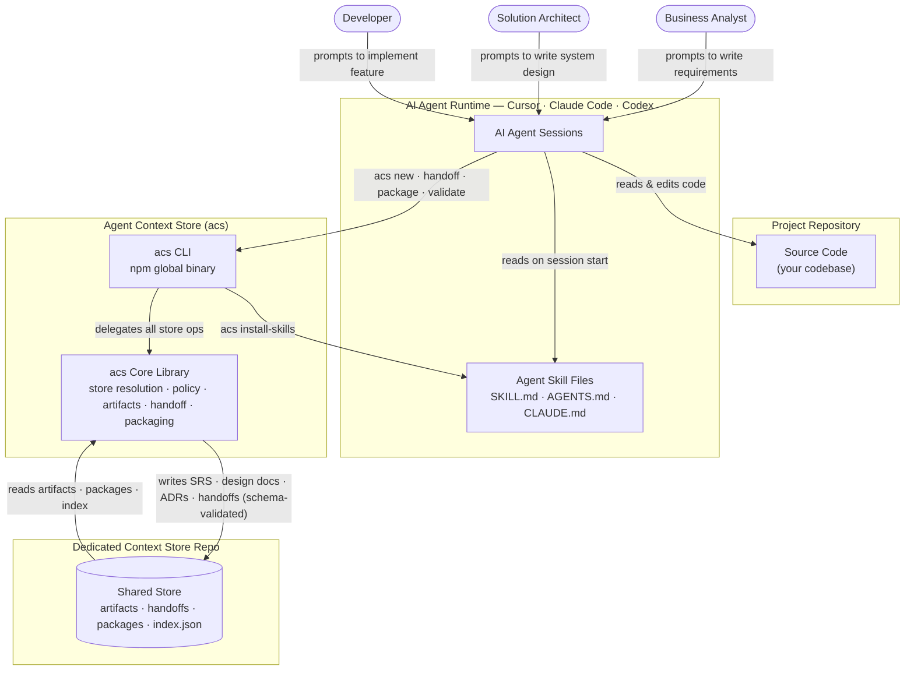

# Agent Context Store

Agent Context Store (`acs`) is a Git-backed, schema-validated handoff toolkit that gives each AI agent role (BA, SA, Dev, QA) a structured way to produce, validate, and pass SDLC artifacts to the next role.

Each role agent writes schema-validated documents — SRS, design docs, ADRs, API specs, test plans — with structured frontmatter into a Git-tracked store. A validated handoff record acts as the contract between agents; the receiving agent packages and reads it before starting work. Works with Cursor, Claude Code, Codex, CI pipelines, and any custom agent runtime.

## Architecture



| Step | What happens |
|------|--------------|
| **1 · Install skills** | `acs install-skills` copies `SKILL.md` / `AGENTS.md` / `CLAUDE.md` into each agent's config directory — teaches the agent which role commands to run. |
| **2 · Agent reads skills** | On task start the agent reads its skill file to learn the `acs` command set and the BA→SA→Dev→QA handoff chain. |
| **3 · Agent creates artifacts** | Each role agent calls `acs <role> new` to produce schema-validated artifacts with structured frontmatter (task ID, role, type, status, timestamps). |
| **4 · Structured handoff** | On completion, the agent calls `acs handoff create` to produce a validated YAML handoff record — the contract the next agent must check (`acs handoff check`) and package (`acs package`) before starting. |
| **5 · Store persists context** | All artifacts, handoff records, and role packages are written to the dedicated Git-tracked store and shared across all role agents and CI pipelines. |

## Prerequisites
- Node.js `>=20`
- Git
- A project repository or folder

## Step 1: Install the CLI
```bash
npm install -g agent-context-store
acs --help
```

## Step 2: Initialize the store

Run `acs init` in your project directory. When stdin is a terminal, an interactive wizard guides you through three choices:

```
? How should the context store be hosted?
  ❯ in-repo   — .acs/ lives inside this project (default)
    local     — stored in your user data dir, nothing committed
    dedicated — a separate repo shared across multiple projects

? Path to the dedicated store repo:   ← only shown for dedicated mode

? Install agent skill files? (space to toggle)
  ✓ Claude Code  → ~/.claude/skills/
  ✓ Cursor       → ~/.cursor/skills/
  ○ Codex        → ~/.codex/skills/
```

A summary is shown before anything is written, and you can abort with `n`.

## Step 3: Run Your First Workflow

After setup, each team member opens their AI agent (Cursor or Claude Code) and invokes the matching role skill by name. The skill tells the agent exactly which `acs` commands to run — the human never types `acs` directly.

> **Skill invocation syntax**
> - Cursor / Claude Code: `@acs-ba`, `@acs-sa`, `@acs-dev`, `@acs-qa`

The examples below follow a single feature task `DEMO-0001: Login with OTP` through the full BA → SA → Dev → QA lifecycle.

---

### Use Case 1 — BA captures requirements

**Human → Cursor / Claude Code:**
```
/acs-ba We need to add OTP-based login. Task ID is DEMO-0001. Title: "Login with OTP".
```

The `acs-ba` skill activates and the agent internally runs:
```bash
acs status && acs doctor
acs ba new srs --task DEMO-0001 --title "Login with OTP"
acs validate --role ba --task DEMO-0001
acs handoff create --from ba --to sa --task DEMO-0001
acs package --task DEMO-0001 --role sa
acs index
```

The agent ends its response with a structured `[HANDOFF: BA → SA | DEMO-0001]` prompt for the SA agent to pick up.

---

### Use Case 2 — SA produces system design

**Human → Cursor / Claude Code:**
```
/acs-sa Pick up DEMO-0001 from BA. Design the OTP login system.
```

The `acs-sa` skill activates and the agent internally runs:
```bash
acs next --role sa --task DEMO-0001
acs sa new sdd --task DEMO-0001 --title "Login with OTP System Design"
acs sa new adr --task DEMO-0001 --title "Use Redis for OTP State"
acs sa new api-design --task DEMO-0001 --title "OTP Login API"
acs validate --role sa --task DEMO-0001
acs handoff create --from sa --to dev --task DEMO-0001
acs package --task DEMO-0001 --role dev
acs index
```

The agent ends its response with a `[HANDOFF: SA → DEV | DEMO-0001]` prompt.

---

### Use Case 3 — Dev implements the feature

**Human → Cursor / Claude Code:**
```
/acs-dev Implement DEMO-0001 based on the SA design. Task ID is DEMO-0001.
```

The `acs-dev` skill activates and the agent internally runs:
```bash
acs next --role dev --task DEMO-0001
acs dev new implementation-note --task DEMO-0001
acs validate --role dev --task DEMO-0001
acs handoff create --from dev --to qa --task DEMO-0001
acs package --task DEMO-0001 --role qa
acs index
```

The agent ends its response with a `[HANDOFF: DEV → QA | DEMO-0001]` prompt.

---

### Use Case 4 — QA validates and closes the task

**Human → Cursor / Claude Code:**
```
/acs-qa Write the test plan for DEMO-0001.
```

The `acs-qa` skill activates and the agent internally runs:
```bash
acs next --role qa --task DEMO-0001
acs qa new test-plan --task DEMO-0001 --title "OTP Login Test Plan"
acs validate --role qa --task DEMO-0001
acs handoff list --task DEMO-0001
acs index
```

All four role artifacts and handoff records are now persisted in the store.

## How Agents Should Use It

Give each agent access to the same project (in-repo mode) or context store repository (dedicated mode) and instruct it to use `acs` for durable handoffs.

Suggested agent instruction:

```text
Use Agent Context Store for durable project context.
Before creating or handing off work, run acs status and acs validate.
Use acs roles, acs role explain, and acs next to follow the configured workflow.
Create task artifacts with acs new or acs <role> new.
Create role handoffs with acs handoff create.
Generate the next role package with acs package.
Commit context store changes to the configured Git repository.
```

## Context Store Layout

### In-repo mode (default)

```text
.acs/
  config.yaml
  acs.yaml
  index.json
  audit/
  artifacts/
    <artifact-type>/
  handoffs/
  summaries/
  packages/
  roles/
  artifact-types/
  workflows/
  schemas/
  templates/
  docs/
```

### Dedicated mode

```text
<store-root>/
  config.yaml
  acs.yaml
  index.json
  audit/
  artifacts/
  handoffs/
  summaries/
  packages/
  roles/
  artifact-types/
  workflows/
  schemas/
  templates/
  docs/
```

Important outputs:

- `artifacts/`: durable SDLC artifacts such as requirements, designs, ADRs, API notes, and test plans.
- `handoffs/`: explicit role-to-role handoff records.
- `packages/`: role-specific context bundles for the next agent.
- `index.json`: generated artifact and handoff index.
- `audit/`: local audit log for CLI-created changes.

In **in-repo mode** all paths above are inside `.acs/`.

## Commands

| Command              | What it does                                                                                            | Example                                                      |
| -------------------- | ------------------------------------------------------------------------------------------------------- | ------------------------------------------------------------ |
| `acs --version`      | Prints the installed CLI version.                                                                       | `acs --version`                                              |
| `acs init`           | Initializes the context store. Runs an interactive wizard on a TTY; pass `--mode` to skip it.          | `acs init`, `acs init --mode local`                         |
| `acs status`         | Shows current mode, store path, initialized state, and artifact/handoff counts.                         | `acs status`                                                 |
| `acs install-skills` | Installs agent-specific skill and instruction files for Cursor, Claude, Codex, or all supported agents. | `acs install-skills --agent cursor`                          |
| `acs roles`          | Lists configured role profiles.                                                                         | `acs roles`                                                  |
| `acs role explain`   | Explains what a role can create/read and suggests task commands.                                        | `acs role explain dev --task TASK-123`                       |
| `acs next`           | Shows missing inputs, suggested outputs, and next workflow commands.                                    | `acs next --role sa --task TASK-123`                         |
| `acs new`            | Creates a configured SDLC artifact.                                                                     | `acs ba new srs --task TASK-123`                             |
| `acs validate`       | Validates the context store structure, artifact metadata, schemas, and handoff records.                 | `acs validate --role dev --task TASK-123`                    |
| `acs handoff create` | Creates a role-to-role handoff record for a task.                                                       | `acs handoff create --from sa --to dev --task TASK-123`      |
| `acs handoff check`  | Validates a specific handoff before another agent relies on it.                                         | `acs handoff check HOFF-TASK-123-SA-DEV`                     |
| `acs handoff list`   | Lists handoff records, optionally filtered by task or role.                                             | `acs handoff list --task TASK-123`                           |
| `acs package`        | Builds a role-specific context package for the next agent or automation step.                           | `acs package --task TASK-123 --role dev`                     |
| `acs index`          | Rebuilds `index.json` from artifacts and handoffs.                                                      | `acs index`                                                  |
| `acs doctor`         | Runs the same validation checks as `acs validate` for quick health checks.                              | `acs doctor`                                                 |

### Command - Reference

```bash
acs --version
acs init [path] [--mode <in-repo|local|dedicated>]
acs status
acs install-skills --agent <cursor|claude|codex|openclaw|all> [--path <path>]
acs roles
acs role explain <ROLE> [--task <TASK_ID>]
acs new <ARTIFACT_TYPE> [--role <ROLE>] --task <TASK_ID> [--title <TITLE>]
acs <ROLE> new <ARTIFACT_TYPE> --task <TASK_ID> [--title <TITLE>]
acs next --role <ROLE> --task <TASK_ID>
acs validate [--role <ROLE>] [--task <TASK_ID>] [--artifact <PATH>]
acs handoff create --from <ROLE> --to <ROLE> --task <TASK_ID>
acs handoff check <HANDOFF_ID_OR_PATH>
acs handoff check --from <ROLE> --to <ROLE> --task <TASK_ID>
acs handoff list [--task <TASK_ID>] [--role <ROLE>]
acs package --task <TASK_ID> --role <ROLE> [--format markdown|json]
acs <ROLE> package --task <TASK_ID> [--format markdown|json]
acs index
acs doctor
```

Common roles:

- `ba`
- `sa`
- `dev`
- `developer`
- `qa`
- `reviewer`


### Command - init

Pass `--mode` to skip the wizard entirely:

```bash
acs init                        # wizard (TTY only)
acs init --mode in-repo         # silent, creates .acs/ in current dir
acs init --mode local           # silent, stores in OS user-data dir
acs init --mode dedicated .     # silent, current dir is the store root
```

`acs` supports three storage modes:

| Mode | Where context is stored | Best for |
|------|------------------------|----------|
| **in-repo** _(default)_ | `.acs/` inside your project | Most projects — context stays with code |
| **local** | OS user-data dir | Personal workflows, no repo changes |
| **dedicated** | This folder IS the store root | Multi-project teams, CI governance |

### Command - install-skills

The wizard offers to install skill files during `acs init`. You can also run this separately at any time:

```bash
acs install-skills --agent cursor
acs install-skills --agent claude
acs install-skills --agent codex
acs install-skills --agent all
acs install-skills --agent all --path /path/to/repo
```

| Agent      | Skill files installed |
| ---------- | --------------------- |
| `cursor`   | `AGENTS.md`, `~/.cursor/skills/agent-context-store/SKILL.md` |
| `claude`   | `CLAUDE.md`, `~/.claude/skills/agent-context-store/SKILL.md` |
| `codex`    | `AGENTS.md`, `~/.codex/skills/agent-context-store/SKILL.md`  |
| `openclaw` | _(not yet available — warning only)_ |
| `all`      | All of the above except openclaw |

Skill files are always replaced with the bundled version. If `AGENTS.md` or `CLAUDE.md` already exists, the installer appends to it.

## Developing This Repository

If you want to modify or test the toolkit itself, see [DEVELOPMENT.md](DEVELOPMENT.md).
