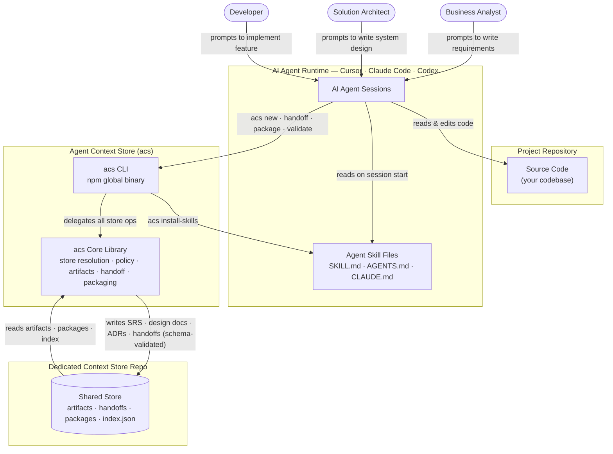

<!-- This file is generated from ../../../README.md by scripts/sync-cli-readme.mjs. Do not edit directly. -->

# Agent Context Store

Agent Context Store (`acs`) is a Git-backed, schema-validated handoff toolkit that gives each AI agent role (BA, SA, Dev, QA) a structured way to produce, validate, and pass SDLC artifacts to the next role.

Each role agent writes schema-validated documents — SRS, design docs, ADRs, API specs, test plans — with structured frontmatter into a Git-tracked store. A validated handoff record acts as the contract between agents; the receiving agent packages and reads it before starting work. Works with Cursor, Claude Code, Codex, CI pipelines, and any custom agent runtime.

`acs` is built on the same handoff principles formalized by the [OpenAI Agents SDK](https://openai.github.io/openai-agents-python/handoffs/), the [Microsoft Agent Framework](https://learn.microsoft.com/en-us/agent-framework/workflows/orchestrations/handoff) handoff orchestration, and Google's [Agent2Agent (A2A) protocol](https://github.com/a2aproject/A2A) — applied to the SDLC roles BA, SA, Dev, QA, and persisted to Git so handoffs survive across runtimes, sessions, and CI.

## Architecture



| Step | What happens |
|------|--------------|
| **1 · Install skills** | `acs install-skills` copies `SKILL.md` / `AGENTS.md` / `CLAUDE.md` into each agent's config directory — teaches the agent which role commands to run. |
| **2 · Agent reads skills** | On task start the agent reads its skill file to learn the `acs` command set and the BA→SA→Dev→QA handoff chain. |
| **3 · Agent creates artifacts** | Each role agent calls `acs <role> new` to produce schema-validated artifacts with structured frontmatter (task ID, role, type, status, timestamps). |
| **4 · Structured handoff** | On completion, the agent calls `acs handoff create` to produce a validated YAML handoff record — the contract the next agent must check (`acs handoff check`) and package (`acs package`) before starting. |
| **5 · Store persists context** | All artifacts, handoff records, and role packages are written to the dedicated Git-tracked store and shared across all role agents and CI pipelines. |

## Prerequisites
- Node.js `>=20`
- Git
- A project repository or folder

## Step 1: Install the CLI
```bash
npm install -g agent-context-store
acs --help
```

## Step 2: Initialize the store

Run `acs init` in your project directory. When stdin is a terminal, an interactive wizard guides you through three choices:

```
? How should the context store be hosted?
  ❯ in-repo   — .acs/ lives inside this project (default)
    local     — stored in your user data dir, nothing committed
    dedicated — a separate repo shared across multiple projects

? Path to the dedicated store repo:   ← only shown for dedicated mode

? Install agent skill files? (space to toggle)
  ✓ Claude Code  → ~/.claude/skills/
  ✓ Cursor       → ~/.cursor/skills/
  ○ Codex        → ~/.codex/skills/
```

A summary is shown before anything is written, and you can abort with `n`.

Pass `--mode` to skip the wizard entirely:

```bash
acs init                        # wizard (TTY only)
acs init --mode in-repo         # silent, creates .acs/ in current dir
acs init --mode local           # silent, stores in OS user-data dir
acs init --mode dedicated .     # silent, current dir is the store root
```

| Mode | Where context is stored | Best for |
|------|------------------------|----------|
| **in-repo** _(default)_ | `.acs/` inside your project | Most projects — context stays with code |
| **local** | OS user-data dir | Personal workflows, no repo changes |
| **dedicated** | This folder IS the store root | Multi-project teams, CI governance |

## Step 3: Run Your First Workflow

After setup, each team member opens their AI agent (Cursor or Claude Code) and invokes the matching role skill by name. The skill tells the agent exactly which `acs` commands to run — the human never types `acs` directly.

> **Skill invocation syntax**
> - Cursor / Claude Code: `@acs-ba`, `@acs-sa`, `@acs-dev`, `@acs-qa`

The examples below follow a single feature task `DEMO-0001: Login with OTP` through the full BA → SA → Dev → QA lifecycle.

---

### Use Case 1 — BA captures requirements

**Human → Cursor / Claude Code:**
```
/acs-ba We need to add OTP-based login. Task ID is DEMO-0001. Title: "Login with OTP".
```

The `acs-ba` skill activates and the agent internally runs:
```bash
acs status && acs doctor
acs ba new srs --task DEMO-0001 --title "Login with OTP"
acs ba new user-story --task DEMO-0001 --title "Login with OTP User Story"
acs ba new acceptance-criteria --task DEMO-0001 --title "Login with OTP Acceptance Criteria"
acs validate --role ba --task DEMO-0001
acs handoff create --from ba --to sa --task DEMO-0001
acs package --task DEMO-0001 --role sa
acs index
```

The agent ends its response with a structured `[HANDOFF: BA → SA | DEMO-0001]` prompt for the SA agent to pick up.

---

### Use Case 2 — SA produces system design

**Human → Cursor / Claude Code:**
```
/acs-sa Pick up DEMO-0001 from BA. Design the OTP login system.
```

The `acs-sa` skill activates and the agent internally runs:
```bash
acs next --role sa --task DEMO-0001
acs sa new sdd --task DEMO-0001 --title "Login with OTP System Design"
acs sa new adr --task DEMO-0001 --title "Use Redis for OTP State"
acs sa new api-design --task DEMO-0001 --title "OTP Login API"
acs validate --role sa --task DEMO-0001
acs handoff create --from sa --to dev --task DEMO-0001
acs package --task DEMO-0001 --role dev
acs index
```

The agent ends its response with a `[HANDOFF: SA → DEV | DEMO-0001]` prompt.

---

### Use Case 3 — Dev implements the feature

**Human → Cursor / Claude Code:**
```
/acs-dev Implement DEMO-0001 based on the SA design. Task ID is DEMO-0001.
```

The `acs-dev` skill activates and the agent internally runs:
```bash
acs next --role dev --task DEMO-0001
acs dev new implementation-note --task DEMO-0001
acs validate --role dev --task DEMO-0001
acs handoff create --from dev --to qa --task DEMO-0001
acs package --task DEMO-0001 --role qa
acs index
```

The agent ends its response with a `[HANDOFF: DEV → QA | DEMO-0001]` prompt.

---

### Use Case 4 — QA validates and closes the task

**Human → Cursor / Claude Code:**
```
/acs-qa Write the test plan for DEMO-0001.
```

The `acs-qa` skill activates and the agent internally runs:
```bash
acs next --role qa --task DEMO-0001
acs qa new test-plan --task DEMO-0001 --title "OTP Login Test Plan"
acs validate --role qa --task DEMO-0001
acs handoff list --task DEMO-0001
acs index
```

All four role artifacts and handoff records are now persisted in the store.

## Context Store Layout

The store root is `.acs/` in **in-repo** mode and `<store-root>/` in **dedicated** mode. Both use the same structure:

```text
<store-root>/
  config.yaml
  acs.yaml
  index.json
  audit/
  artifacts/
    <task-id>/
      <artifact-type>/
  handoffs/
  summaries/
  packages/
  roles/
  artifact-types/
  workflows/
  schemas/
  templates/
  docs/
```

- `artifacts/`: durable SDLC artifacts grouped by task, for example `artifacts/DEMO-0001/srs/SRS-DEMO-0001.md` and `artifacts/DEMO-0001/acceptance-criteria/AC-DEMO-0001.md`.
- `handoffs/`: explicit role-to-role handoff records.
- `packages/`: role-specific context bundles for the next agent.
- `index.json`: generated artifact and handoff index.
- `audit/`: local audit log for CLI-created changes.

Artifact storage is task-first in this version. Older type-first artifact paths are not part of the supported layout.

## Commands

| Command              | What it does                                                                                            |
| -------------------- | ------------------------------------------------------------------------------------------------------- |
| `acs --version`      | Prints the installed CLI version.                                                                       |
| `acs init`           | Initializes the context store. Runs an interactive wizard on a TTY; pass `--mode` to skip it.          |
| `acs status`         | Shows current mode, store path, initialized state, and artifact/handoff counts.                         |
| `acs install-skills` | Installs agent-specific skill and instruction files for Cursor, Claude, Codex, or all supported agents. |
| `acs roles`          | Lists configured role profiles (`ba`, `sa`, `dev`, `qa`).                                              |
| `acs role explain`   | Explains what a role can create/read and suggests task commands.                                        |
| `acs next`           | Shows missing inputs, suggested outputs, and next workflow commands.                                    |
| `acs new`            | Creates a configured SDLC artifact.                                                                     |
| `acs validate`       | Validates the context store structure, artifact metadata, schemas, and handoff records.                 |
| `acs handoff create` | Creates a role-to-role handoff record for a task.                                                       |
| `acs handoff check`  | Validates a specific handoff before another agent relies on it.                                         |
| `acs handoff list`   | Lists handoff records, optionally filtered by task or role.                                             |
| `acs package`        | Builds a role-specific context package for the next agent or automation step.                           |
| `acs index`          | Rebuilds `index.json` from artifacts and handoffs.                                                      |
| `acs doctor`         | Runs the same validation checks as `acs validate` for quick health checks.                              |

### Full syntax

```bash
acs --version
acs init [path] [--mode <in-repo|local|dedicated>]
acs status
acs install-skills --agent <cursor|claude|codex|openclaw|all> [--path <path>]
acs roles
acs role explain <ROLE> [--task <TASK_ID>]
acs new <ARTIFACT_TYPE> [--role <ROLE>] --task <TASK_ID> [--title <TITLE>]
acs <ROLE> new <ARTIFACT_TYPE> --task <TASK_ID> [--title <TITLE>]
acs next --role <ROLE> --task <TASK_ID>
acs validate [--role <ROLE>] [--task <TASK_ID>] [--artifact <PATH>]
acs handoff create --from <ROLE> --to <ROLE> --task <TASK_ID>
acs handoff check <HANDOFF_ID_OR_PATH>
acs handoff check --from <ROLE> --to <ROLE> --task <TASK_ID>
acs handoff list [--task <TASK_ID>] [--role <ROLE>]
acs package --task <TASK_ID> --role <ROLE> [--format markdown|json]
acs <ROLE> package --task <TASK_ID> [--format markdown|json]
acs index
acs doctor
```

### Command - install-skills

The wizard offers to install skill files during `acs init`. You can also run this separately at any time:

```bash
acs install-skills --agent cursor
acs install-skills --agent claude
acs install-skills --agent codex
acs install-skills --agent all
acs install-skills --agent all --path /path/to/repo
```

| Agent      | Skill files installed |
| ---------- | --------------------- |
| `cursor`   | `AGENTS.md`, `~/.cursor/skills/agent-context-store/SKILL.md` |
| `claude`   | `CLAUDE.md`, `~/.claude/skills/agent-context-store/SKILL.md` |
| `codex`    | `AGENTS.md`, `~/.codex/skills/agent-context-store/SKILL.md`  |
| `openclaw` | _(not yet available — warning only)_ |
| `all`      | All of the above except openclaw |

Skill files are always replaced with the bundled version. If `AGENTS.md` or `CLAUDE.md` already exists, the installer appends to it.


## Aligned with Industry Handoff Standards

`acs` adopts the same handoff vocabulary used by the major agent frameworks — typed handoff records, dynamic role-to-role routing, full task ownership transfer, capability advertisement, and durable checkpointing — and grounds them in a Git-tracked store so the handoff itself becomes an auditable, reviewable artifact rather than an in-memory tool call.

| Concept | Industry definition | `acs` equivalent |
|---------|--------------------|------------------|
| **Typed handoff contract** | OpenAI's `handoff()` with `input_type` schema, `handoff_description`, and `on_handoff` callback validates the data passed between agents. [[#1]](#references) | `acs handoff create --from <ROLE> --to <ROLE> --task <TASK_ID>` writes a YAML record validated against a JSON schema; `acs handoff check` is the receiver-side guard equivalent to `on_handoff` validation. |
| **Context filtering on handoff** | OpenAI `input_filter` and Microsoft's `HandoffAgentExecutor` strip handoff tool calls before forwarding to the next agent. [[#1]](#references) [[#2]](#references) | `acs package --task <TASK_ID> --role <ROLE>` builds a role-scoped context bundle so the receiving agent reads only what is relevant to its job. |
| **Full task ownership transfer** | Microsoft Agent Framework: "the agent receiving the handoff takes full ownership of the task" (vs. agent-as-tools, where control returns). [[#2]](#references) | BA → SA → Dev → QA each take complete ownership of the task in their phase; control does not return to the previous role. |
| **Mesh topology, no central orchestrator** | Microsoft: agents are connected directly; each decides when to hand off. [[#2]](#references) | No orchestrator process — each role agent independently decides when its artifacts are complete and issues a handoff. The store is the shared substrate. |
| **Dynamic routing rules** | Microsoft `HandoffBuilder.add_handoff(...)` / `WithHandoffs(...)` declares which agents may route to which. [[#2]](#references) | `workflows/` and `roles/` in the store define the legal BA→SA→Dev→QA edges; `acs validate` rejects out-of-policy handoffs. |
| **Capability discovery (Agent Cards)** | A2A: agents advertise abilities via JSON Agent Cards so peers know what they can do. [[#3]](#references) | `acs roles` and `acs role explain <ROLE>` expose each role's inputs, outputs, and allowed artifact types — the role profile is the Agent Card. |
| **Tasks & artifacts as the unit of exchange** | A2A: communication centers on tasks with lifecycles; artifacts are the task outputs. [[#4]](#references) | Every `acs` operation is keyed by `--task <TASK_ID>`; `artifacts/<TASK_ID>/` holds the schema-validated outputs of each role's task phase. |
| **Durable, resumable workflows** | Microsoft `checkpoint_storage` / `FileCheckpointStorage` lets workflows pause and resume hours or days later. [[#2]](#references) | The Git-tracked store *is* the checkpoint. Any agent on any machine can `git pull` and resume from the last validated handoff. |
| **Runtime-agnostic interoperability** | A2A: opaque agents on different frameworks collaborate without sharing memory or internal state. [[#4]](#references) | Cursor, Claude Code, Codex, and CI agents collaborate purely through validated artifacts and handoff records — no shared runtime, no shared memory. |
| **Auditable handoff history** | A2A emphasizes observability and auditability for enterprise use. [[#4]](#references) | `audit/`, `index.json`, `acs handoff list`, and Git history give a complete, reviewable trail of every handoff. |

In short: industry handoff frameworks model handoffs as in-process tool calls between live agent instances. `acs` models them as **persisted, schema-validated, Git-reviewable contracts** — making the same pattern work across role boundaries, agent runtimes, machines, and time.

### References

1. OpenAI Agents SDK — Handoffs: <https://openai.github.io/openai-agents-python/handoffs/>
2. Microsoft Agent Framework — Handoff Orchestration: <https://learn.microsoft.com/en-us/agent-framework/workflows/orchestrations/handoff?pivots=programming-language-csharp>
3. Google Developers Blog — A2A: A new era of agent interoperability: <https://developers.googleblog.com/en/a2a-a-new-era-of-agent-interoperability/>
4. A2A Project — Agent2Agent protocol repository: <https://github.com/a2aproject/A2A>

## Developing This Repository

If you want to modify or test the toolkit itself, see [DEVELOPMENT.md](DEVELOPMENT.md).
